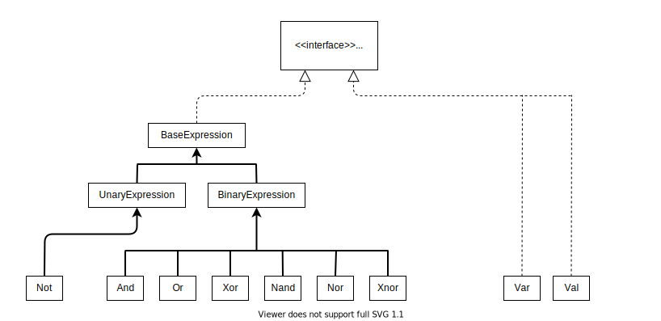
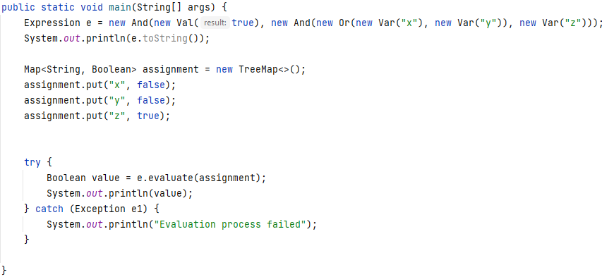
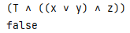
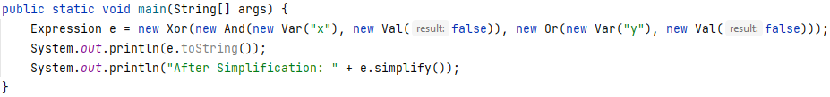
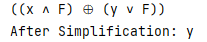
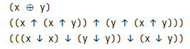

<h4 align="center">


</h4>

<p align="center">
<br />
  <a href="#Introduction">Introduction</a> •
  <a href="#UML">UML Diagram</a> •
  <a href="#Expression Examples">Expression Examples</a> •
  <a href="#Installation">Installation</a> •
  <a href="#Author">Author</a> •
  <a href="#Support">Support</a> 

</p>

## Introduction

<p align="left">
  
I laid out a **system that represents nested logical expressions
with variables, evaluates their values
for specific variable assignments, and simplifies the results.**

Basically, it's a program that interprets logical expressions. 
It can be used for:

* Automatically differentiate and simplify expressions using logic gates.
* Evaluate expressions.
* Get expression's variables.
* Performs procedures on the expression such as - nandify, norify, etc.
  
</p>
<br />


## UML Diagram of the project

<p align="center">



</p>

<br />


## Expressions Examples

### Example 1

<p align="left">


</p>

#### will print:
<p align="left">

  
</p>

<br />

### Example 2

<p align="left">


</p>

#### will print:

<p align="left">



</p>

<br />

### Example 3

<p align="left">


</p>

#### will print:

<p align="left">



</p>


## Installation
### Option 1 - Without Ant
1. Clone the repository:
    ```
    $ git clone https://github.com/TopazAvraham/Math-Expressions-Interpreter.git
    ```

2. Open the project from an IDE such as Intellij, Eclipse, etc.
3. Make sure an updated JDK is set in the configuration, and the src folder of Math-Expressions-Interpreter is set as the source root.
4. Create configuration with ExpressionsTest as the Main Class, run it, and enjoy!

<br />

### Option 2 - With Ant
1. Clone the repository:
    ```
    git clone https://github.com/TopazAvraham/Math-Expressions-Interpreter.git
    ```
2. Install [Apache Ant](https://ant.apache.org/bindownload.cgi) 
 
   if you're having difficulties with the Ant installation proccess, you can click [here](https://www.youtube.com/watchv=3eaW81yYIqY&t=353s&ab_channel=xscourse) for help. 

<br /> 

3. Open CMD in the cloned directory and run this command:
    ```
    ant run
    ```
    

## Built With

- Java


## Author

**Topaz Avraham**

- [Profile](https://github.com/TopazAvraham?tab=repositories )
- [Email](mailto:topazavraham9@gmail.com?subject=Hi "Hi!")
- [LinkedIn](https://www.linkedin.com/in/topaz-avraham-68b340208/ "Welcome")

## 🤝 Support

Contributions, issues, and feature requests are welcome!

Give a ⭐️ if you like this project!

